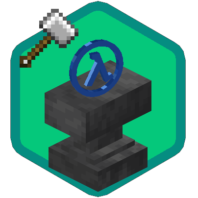

# `ASExtHook`: Plugin to extend Sven Co-op script 

[](https://www.gnu.org/licenses/gpl-3.0)
[](https://github.com/DrAbcOfficial/asexthook/actions)
[](https://github.com/DrAbcOfficial/asexthook/releases)
[](https://github.com/DrAbcOfficial/asexthook/releases)
[](https://github.com/DrAbcOfficial/asexthook)

`ASExtHook` is a Metamod plugin used to extend the Sven Co-op AngelScripts scripting system.

Using this plugin makes it easy to perform operations that were previously exceptionally difficult, such as hooking whether a monster is dead or not.

Auto-generated HTML documentation for the Sven Co-op AsExtHook Angelscript API is available [Here](https://drabcofficial.github.io/asexthook/)

Used HTML Generator [Here](https://github.com/sven-coop/sven-coop.github.io)

---

<!-- vscode-markdown-toc -->
* 1. [Install](#Install)
* 2. [Build](#Build)
* 3. [Document](#Document)
	* 3.1. [Current Expansion Property](#CurrentExpansionProperty)
	* 3.2. [Current Expansion Objects](#CurrentExpansionObjects)
	* 3.3. [Current Expansion Methods](#CurrentExpansionMethods)
	* 3.4. [Expansion Method Examples](#ExpansionMethodExamples)
	* 3.5. [3.5 Expansion CVar](#ExpansionCVar)
	* 3.6. [Current Expansion Hooks](#CurrentExpansionHooks)
		* 3.6.1. [EntitySpawn](#EntitySpawn)
		* 3.6.2. [IRelationship](#IRelationship)
		* 3.6.3. [MonsterSpawn](#MonsterSpawn)
		* 3.6.4. [MonsterTraceAttack](#MonsterTraceAttack)
		* 3.6.5. [BreakableKilled](#BreakableKilled)
		* 3.6.6. [BreakableTakeDamage](#BreakableTakeDamage)
		* 3.6.7. [BreakableTraceAttack](#BreakableTraceAttack)
		* 3.6.8. [PlayerPostTakeDamage](#PlayerPostTakeDamage)
		* 3.6.9. [PlayerTakeHealth](#PlayerTakeHealth)
		* 3.6.10. [PlayerCallMedic](#PlayerCallMedic)
		* 3.6.11. [PlayerCallGrenade](#PlayerCallGrenade)
		* 3.6.12. [PlayerUserInfoChanged](#PlayerUserInfoChanged)
		* 3.6.13. [GrappleGetMonsterType](#GrappleGetMonsterType)

<!-- vscode-markdown-toc-config
	numbering=true
	autoSave=true
	/vscode-markdown-toc-config -->
<!-- /vscode-markdown-toc -->

---

##  1. <a name='Install'></a>Install

1. Grab metamod-p and asext.dll/asext.so [Here](https://github.com/hzqst/metamod-fallguys/releases)

2. Install them.
3. Grab asexthook.dll/asexthook.so, put them into `svencoop/addons/metamod/dlls`
   1.  Grab latest version in [Action](https://github.com/DrAbcOfficial/asexthook/actions/workflows/build.yml) (Unstable, crash risk)
		
		or

   2.  Grab release version in [Release](https://github.com/DrAbcOfficial/asexthook/releases) (Stable)
4. edit `svencoop/addons/metamod/plugins.ini`
5. add 

``` ini

win32 addons/metamod/dlls/asexthook.dll
linux addons/metamod/dlls/asexthook.so

```

6. enjoy your new hook :3

---

##  2. <a name='Build'></a>Build

If you are using systems that are not covered by automatic builds (yum's and aur's) 

or want to add new hooks yourself, you can follow these steps to configure your build environment.

1. Install everything you need
   
	

	1. [Git](https://git-scm.com/download/win) or `winget install --id Git.Git -e --source winget`
	2. [Visual Studio with vc143 toolset](https://visualstudio.microsoft.com/) And [C++ desktop development](https://learn.microsoft.com/en-us/cpp/ide/using-the-visual-studio-ide-for-cpp-desktop-development?view=msvc-170)

	

	1. `sudo apt install git make build-essential gcc gcc-multilib g++-multilib cmake -y`

	

	1. `sudo yum install git make gcc gcc-c++ glibc-devel.i686 libstdc++-devel.i686 cmake -y`

	

	Sorry guys who using Arch, I've never used an Arch based distribution, you'll have to find out how to configure the dependencies yourselves!🙂

2. Clone metamod modified by hzqst
   
   `git clone https://github.com/DrAbcOfficial/metamod-fallguys.git metamod`

   `cd metamod`

3. Clone this

	`git clone https://github.com/DrAbcOfficial/asexthook.git`

	`cd asexthook`

4. Build!

	

	1. Open `asexthook.sln` with visual studio
	2. Press `F7`
	3. Wait and done.

	

	1. `mkdir build && cd build && cmake .. && make`
   
6. Grab
	
	Now you can grab your new library (asexthook.dll/asexthook.so) in 
	
	`metamod/build/addons/metamod/dlls/`

##  3. <a name='Document'></a>Document

###  3.1. <a name='CurrentExpansionProperty'></a>Current Expansion Property
 
|Class|Namespace|Object|
|---|---|---|
|CBinaryStringBuilder|\<Global\>|g_BinaryStringBuilder|

###  3.2. <a name='CurrentExpansionObjects'></a>Current Expansion Objects

```
class HealthInfo{
	CBaseEntity@ pEntity;
	float flHealth;
	int bitsDamageType;
	int health_cap;
}
```

---

###  3.3. <a name='CurrentExpansionMethods'></a>Current Expansion Methods

|Class|Method|Explian|
|---|---|---|
|CEngineFuncs|uint32 CRC32(const string& in szBuffer)|Caculate CRC32 for a string|
|CEngineFuncs|bool ClassMemcpy(?& in src, ?& in dst)|copy class, If src and dst are different type, return false. If not class ref, crash game.|
|---|---|---|
|CBinaryStringBuilder|More info click url👉|[CBinaryStringBuilder](https://drabcofficial.github.io/asexthook/CBinaryStringBuilder.htm)|
|CSQLite|More info click url👉|[CSQLite](https://drabcofficial.github.io/asexthook/CSQLite.htm)|


###  3.4. <a name='ExpansionMethodExamples'></a>Expansion Method Examples

[Example](https://github.com/DrAbcOfficial/asexthook/tree/main/example)


###  3.5. <a name='ExpansionCVar'></a>3.5 Expansion CVar

|CVar|default|explain|
|--|--|--|
|sv_fixgmr|1|add gmr found before SV_ModelIndex to fix gmr crash game|

###  3.6. <a name='CurrentExpansionHooks'></a>Current Expansion Hooks

---

####  3.6.1. <a name='EntitySpawn'></a>EntitySpawn

```
Hooks::Entity const uint32 EntitySpawn (CBaseEntity@ pEntity)
```

Call after original CBaseEntity::Spawn called.

StopMode: CALL_ALL

MapScript | Plugin

---

####  3.6.2. <a name='IRelationship'></a>IRelationship

```
Hooks::Entity const uint32 IRelationship (CBaseEntity@ pEntity, CBaseEntity@ pOther, bool param, int& out newValue)
```

Pre call before checking relation.

if newValue changed, will use new relationship.

StopMode: CALL_ALL

MapScript | Plugin

---

####  3.6.3. <a name='MonsterSpawn'></a>MonsterSpawn

```
Hooks::Monster const uint32 MonsterSpawn (CBaseMonster@ pMonster)
```

Call after who having FL_MONSTER entity CBaseEntity::Spawn called.

StopMode: CALL_ALL

MapScript | Plugin

---


####  3.6.6. <a name='MonsterTraceAttack'></a>MonsterTraceAttack

```
Hooks::Monster const uint32 MonsterTraceAttack (CBaseMonster@ pMonster, entvars_t@ pevAttacker, float flDamage, Vector vecDir, const TraceResult& in ptr, int bitDamageType)
```

Call before origin CBaseMonster::TraceAttack called.

StopMode: CALL_ALL

MapScript | Plugin

---


####  3.6.7. <a name='BreakableKilled'></a>BreakableKilled

```
Hooks::Entity const uint32 BreakableKilled (CBaseEntity@ pBreakable, entvars_t@ pevAttacker, int iGib)
```

Call before origin CBreakable::Die called.

StopMode: CALL_ALL

MapScript | Plugin

---

####  3.6.8. <a name='BreakableTakeDamage'></a>BreakableTakeDamage

```
Hooks::Entity const uint32 BreakableTakeDamage (DamageInfo@ info)
```

Call before origin CBreakable::TakeDamage called.

StopMode: CALL_ALL

MapScript | Plugin

---

####  3.6.9. <a name='BreakableTraceAttack'></a>BreakableTraceAttack

```
Hooks::Monster const uint32 MonsterTraceAttack (CBaseEntity@ pBreakable, entvars_t@ pevAttacker, float flDamage, Vector vecDir, const TraceResult& in ptr, int bitDamageType)
```

Call before origin CBreakable::TraceAttack called.

Notice that player died will call this hook, because player is monster too.

StopMode: CALL_ALL

MapScript | Plugin

---

####  3.6.10. <a name='PlayerPostTakeDamage'></a>PlayerPostTakeDamage

```
Hooks::Player const uint32 PlayerPostTakeDamage (DamageInfo@ info)
```

Call after origin CBasePlayer::TakeDamage called.

StopMode: CALL_ALL

MapScript | Plugin

---

####  3.6.11. <a name='PlayerTakeHealth'></a>PlayerTakeHealth

```
Hooks::Player const uint32 PlayerTakeHealth (HealthInfo@ info)
```

Call after origin CBasePlayer::TakeHealth called.

StopMode: CALL_ALL

MapScript | Plugin

---

####  3.6.12. <a name='PlayerCallMedic'></a>PlayerCallMedic

```
Hooks::Player const uint32 PlayerCallMedic (CBasePlayer@ pPlayer)
```

Call before "Medic!!!!"

StopMode: CALL_ALL

MapScript | Plugin


---

####  3.6.13. <a name='PlayerCallGrenade'></a>PlayerCallGrenade

```
Hooks::Player const uint32 PlayerCallGrenade (CBasePlayer@ pPlayer)
```

Call before "Take Cover!!!!"

StopMode: CALL_ALL

MapScript | Plugin

---

####  3.6.14. <a name='PlayerUserInfoChanged'></a>PlayerUserInfoChanged

```
Hooks::Player const uint32 PlayerUserInfoChanged (CBasePlayer@ pClient, string szInfoBuffer, uint&out uiFlag)
```

Call before player userinfo changed (e.g: name change)

will block original call if uiFlag not 0

StopMode: CALL_ALL

MapScript | Plugin

---

####  3.6.15. <a name='GrappleGetMonsterType'></a>GrappleGetMonsterType

```
Hooks::Weapon const uint32 GrappleGetMonsterType (CBaseEntity@ pThis, CBaseEntity@ pEntity, uint& out flag)
```

Pre call before Weapon Grapple checking monster type

No more hardcoded grapple, yay!

out return value:
|value|result|
|---|---|
|1|pull monster to player|
|2|pull player to monster|
|other|use default|

StopMode: CALL_ALL

MapScript | Plugin

---

####  3.6.16. <a name='SendScoreInfo'></a>SendScoreInfo

```
Hooks::Player const uint32 SendScoreInfo (CBasePlayer@ pPlayer, edict_t@ pTarget, int iTeamID, string szTeamName, uint& out flag)
```

Pre call before sending hud info to edict

will block original call if out value not 0.

StopMode: CALL_ALL

MapScript | Plugin

---
